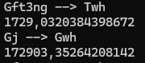

# По задаче

Реализовав алгоритм и запустив получаю:

Ошибка в данном случае не связана с таблицей мултипликации, т.к. коэффициенты будут отличатся, если привести их к одной ЕИ:

172903`2`0384398672

172903`3`5264208142

Если построить 2 цепочки

1. Twh <- Gft3ng <- Gm3ng <- Mm3ng <- Mtce <- Gtce <- Gtoe <- Mtoe
2. Gwh <- Gj <- Mj <- MMbtu <- Qbtu <- Bboe <- Kboe <- Ktoe <- Gtoe <- Mtoe

в них прослеживается, что цепочки расходятся в Gtce и Kboe, т.е. причина отличия заключается в коэффициентах.

## Решение

Сообщить клиенту, о найденных проблемах. Попросить найти и поправить коэффициент, предоставив цепочки, по которым получаются неверные результаты.

## Улучшение алгоритма

Думаю стоит в таблице конвертации предоставлять только базовые ЕИ, т.к. степенные приставки легко добавить к базовой ЕИ.
