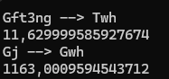

# По задаче

Реализовав алгоритм и запустив получаю:

Сам алгоритм построен корректно. Ошибка в данном случае связана с таблицей конвертации, т.к. результаты отличаются:

> 172903`2`0384398672
>
> 172903`3`5264208142

очевидно данные различия не могут быть вызваны погрешностью

Если построить 2 цепочки

1. Twh <- Gft3ng <- Gm3ng <- Mm3ng <- Mtce <- Gtce <- Gtoe <- Mtoe
2. Gwh <- Gj <- Mj <- MMbtu <- Qbtu <- Bboe <- Kboe <- Ktoe <- Gtoe <- Mtoe

в них прослеживается, что цепочки расходятся в Gtce и Kboe, вероятно причина отличия заключается в них, либо последующий коэффициентах.

Для наглядности проверим, какой коэффициент перевода в 1 и во 2 случаях, для этого выставим Mtoe 1, получим

видно, что переводы получаются разными, так если приведем к wh. то получим:

1. 11629999585927,674
2. 1163000959454,3713

## Решение

Сообщить клиенту, о найденных проблемах. Попросить найти и поправить коэффициент, предоставив цепочки, по которым получаются неверные результаты.

## Улучшение алгоритма

Думаю стоит в таблице конвертации предоставлять только базовые ЕИ, т.к. степенные приставки легко добавить к базовой ЕИ.
